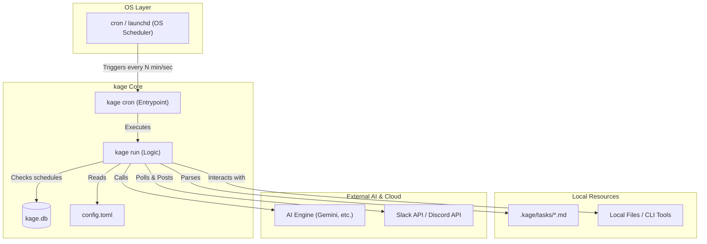
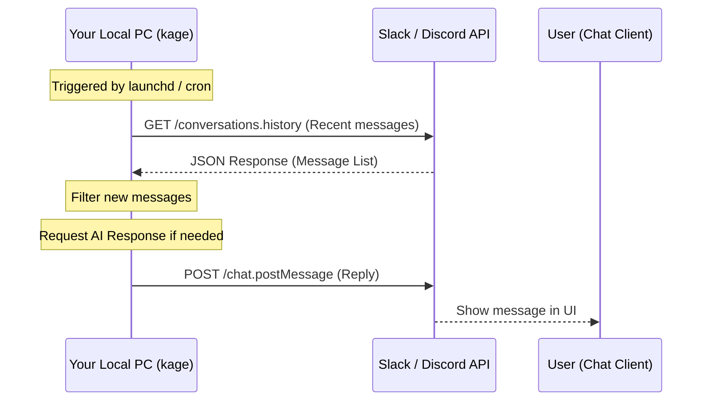

# kage 影 - Technical Architecture

This document describes the system design, execution mechanism, and security details of `kage`.

## System Overview

`kage` adopts a **"Pull-based (Polling)"** architecture triggered by OS standard schedulers (`cron` or `launchd`).

---

## Core Mechanisms

### 1. Scheduler-Driven Execution
`kage` itself does not run as a persistent background process (daemon) that consumes memory. Instead, it is invoked on-demand by OS standard tools like `cron` (Linux) or `launchd` (macOS) at specified intervals.

- **`kage cron install`**: Registers `kage run` to the OS scheduler.
- **Stateless Design**: Upon each execution, it evaluates the current context (`.kage/tasks` and `config.toml`). If a task needs to be run, it calls the AI engine. Once finished, the process exits.

### 2. Polling-based Connectors
The Discord and Slack connectors in `kage` operate by **periodically fetching messages (polling)** rather than waiting for Webhooks or WebSockets (push-based).

---

## Security & Privacy

This "Pull-based (Polling)" architecture provides critical advantages for running agents on a local PC or home server.

### 1. No Public IP Required
Push-based Webhooks require a public IP address or complex tunneling (like `ngrok`) to allow external servers to access your PC. 
`kage` only sends outgoing requests, meaning **it works perfectly and securely behind NAT/firewalls without any port forwarding.**

### 2. Secure Local Access
AI agents often need access to local files and private project data. Since `kage` runs on your machine with your permissions, it interacts with the AI engine by extracting only the necessary context, without ever uploading your entire codebase to a cloud service.

### 3. Fail-safe Persistence
Even if your PC sleeps or loses power, the OS scheduler will automatically resume tasks upon the next wake/boot. There is no complex process management to worry about.

---

## Data Structure

- **`.kage/tasks/*.md`**: Manages instructions and schedules in a Pydantic-based YAML front matter format.
- **`~/.kage/kage.db`**: Stores stateful information like last execution times and read message IDs via SQLite.
- **`~/.kage/config.toml`**: Stores global configuration including AI engine settings and API tokens.
