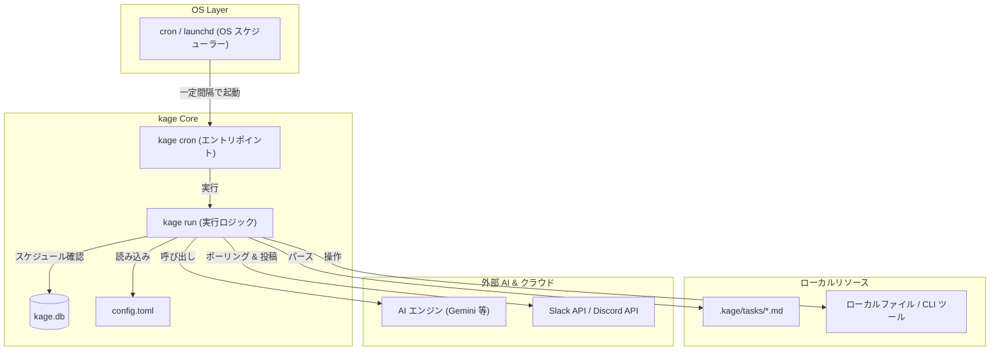
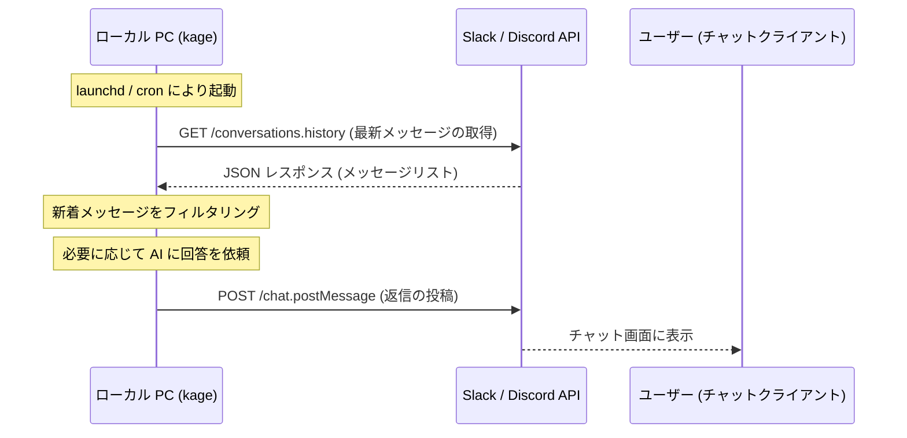

# kage 影 - 技術構成 (Technical Architecture)

このドキュメントでは、`kage` のシステム設計、実行メカニズム、およびその安全性についての技術的な詳細を解説します。

## 全体概要 (System Overview)

`kage` は、OS 標準のスケジューラー（`cron` または `launchd`）を起点とした **「プル型（Polling）」** のアーキテクチャを採用しています。

---

## 核心メカニズム (Core Mechanisms)

### 1. スケジューラー駆動型実行
`kage` 自体は常駐プロセス（デーモン）として常にメモリを消費し続けるのではなく、OS 標準の `cron` (Linux) や `launchd` (macOS) によって、指定された間隔（1分ごと、あるいは数秒ごと）で「その都度」起動されます。

- **`kage cron install`**: OS のスケジューラーに `kage run` を登録します。
- **ステートレスな設計**: 起動のたびに現在のコンテキスト（`.kage/tasks` や `config.toml`）を評価し、実行が必要なタスクがあれば AI を呼び出します。実行が終わればプロセスは終了します。

### 2. コネクターのポーリング方式 (Polling-based Connectors)
`kage` の Discord/Slack コネクターは、**Webhook や WebSocket による待機（プッシュ型）ではなく、定期的なメッセージ取得（プル型）** で動作します。

---

## 安全性とプライバシー (Security & Privacy)

この「ポーリング（プル型）」アーキテクチャこそが、自宅や手持ちの PC でエージェントを運用する上で最大のメリットとなります。

### 1. 公開 IP アドレスが不要
プッシュ型の Webhook 受信を行う場合、インターネットから自分の PC にアクセスできるグローバル IP アドレスや、ルーターのポート開放、あるいは `ngrok` のようなトンネリングツールが必要です。
`kage` は自分から外部へリクエストを投げに行くだけなので、**プライベートネットワーク内（NAT 内）で設定変更なしに、かつ安全に動作します。**

### 2. セキュアなローカルアクセス
AI エージェントはローカルファイルや社外秘のプロジェクトデータにアクセスする必要があります。`kage` はあなたの PC 上で、あなたの権限で動作するため、外部のクラウドサービスにローカルファイルをアップロードすることなく、必要なコンテキストだけを抽出して AI と対話できます。

### 3. デッドマンズスイッチ (Fail-safe)
PC がスリープしたり電源が切れたりしても、OS のスケジューラーが次回の復帰時に自動的に再開させます。複雑なプロセス管理や監視を必要とせず、堅牢な運用が可能です。

---

## データ構造 (Data Structure)

- **`.kage/tasks/*.md`**: Pydantic をベースとした YAML フロントマター形式で、AI への指示と実行スケジュールを管理します。
- **`~/.kage/kage.db`**: タスクの最終実行時刻や、各コネクターの既読メッセージ ID などの状態（State）を SQLite で管理します。
- **`~/.kage/config.toml`**: 使用する AI エンジン、各プラットフォームの API トークン、および実行間隔などのグローバル設定を保持します。
