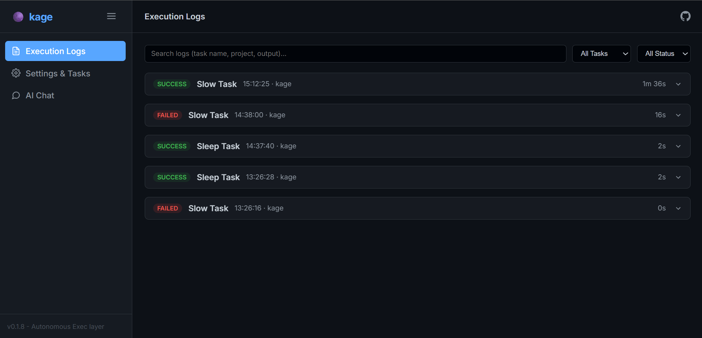
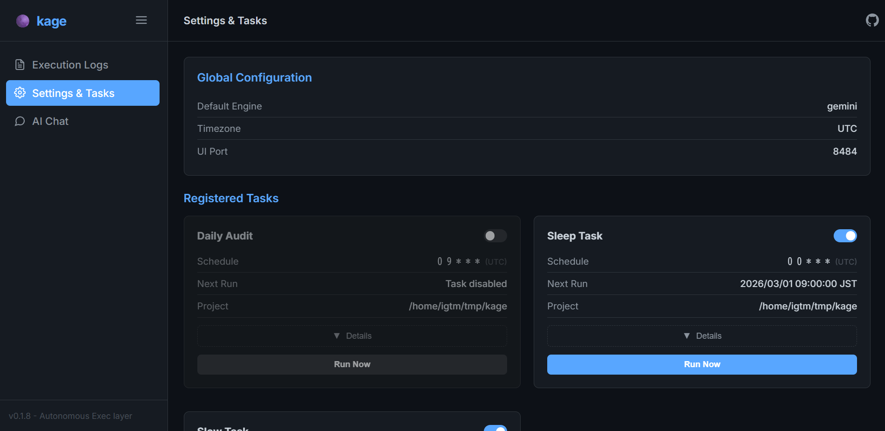

# kage 影 - 自律型 AI プロジェクトエージェント


[English](./README.md) | 日本語

`kage` は、OS標準の **cron** や **launchd** を活用した、極めて軽量かつ透明性の高い AI エージェント実行レイヤーです。公式 AI CLI（`gemini`, `claude`, `codex`, `opencode`, `copilot` 等）をヘッドレスモードで直接駆動し、常駐デーモンなしで動作します。仕事用のPCにインストールして開発リポジトリ内にやりたいことを Markdown で書き、あとはPCを起動したまま眠りにつくだけです。朝起きたときには AI があなたの代わりに仕事を終えており、答えの用意された状態で一日を始めることができます。

> **寝ている間に、成果を。** — `kage` はあなたの代わりに夜通しAIエージェントを走らせます。朝起きたとき、そこにあるのは「疑問」ではなく「答え」です。

## 設計思想 (Design Philosophy)

`kage` は、**「薄く、透明で、リソース効率の良い」** 実行レイヤーであることを目指して設計されています。

- **OS ネイティブ**: 独自の常駐デーモンを持ちません。**cron (Linux)** や **launchd (macOS)** という OS 標準の仕組みを利用して、必要な時だけ起動し、仕事を終えると速やかに終了します。待機時のメモリ消費はゼロです。
- **公式 CLI 活用**: Gemini や Claude、GCP SDK などの **公式 AI CLI ツール** をヘッドレスモードでそのまま利用します。非公式 API や不安定な内部実装に依存せず、確実な動作を提供します。
- **ステートレス & 透明性**: すべての実行はログに記録され、状態管理は SQLite と Markdown ファイルのみで行われるシンプルで追いかけやすい構成です。

## ダッシュボード

| 実行ログ | 設定 & タスク |
|:-:|:-:|
|  |  |

## 特徴

- **自律型エージェントロジック**: タスクを GFM チェックリストへ自動分解し、進捗を追跡。
- **永続メモリシステム**: `.kage/memory/` に状態を保存し、実行を跨いだ文脈の維持が可能。
- **超軽量な実行**: OS 標準のスケジューラーを活用。バックグラウンドでの無駄なリソース消費がありません。
- **柔軟な実行形式**: AIプロンプト、シェルコマンド、カスタムスクリプトに対応。AI プロンプト（Markdown 本文）と直接コマンド実行（Front Matter 内の `command`）の両方をサポート。
- **高度な制御 (Workflow)**:
    - **実行モード**: `continuous` (常時), `once` (一回), `autostop` (AIが完了判断時に停止)。
    - **多重起動制御**: `allow`, `forbid` (重複スキップ), `replace` (古い方を終了)。
    - **時間枠制限**: `allowed_hours: "9-17"`, `denied_hours: "12"` のように実行時間を制限。
- **Markdown 本位**: YAML front matter を持つシンプルな Markdown ファイルでタスクを定義。
- **コネクター**: Discord/Slack/Telegram との連携。タスク通知は常に有効。双方向チャットは `poll = true` で有効化（⚠️ チャンネルの参加者にPC上のAIへのアクセスを許可します）。
- **思考プロセスの隔離**: AIエージェントの推論過程を `<think>` タグで隔離し、通知やログから自動的に除外してクリーンな結果のみを表示します。
- **多層的な設定**: `.kage/config.local.toml` > `.kage/config.toml` > `~/.kage/config.toml` > デフォルト。
- **Webダッシュボード**: 実行履歴、タスク管理、AIチャットを一箇所で提供。

詳細な技術解説は [技術構成ドキュメント](ARCHITECTURE_JA.md) を参照してください。

## インストール

```bash
curl -sSL https://raw.githubusercontent.com/igtm/kage/main/install.sh | bash
```

## クイックスタート

```bash
cd your-project
kage init         # 現在のディレクトリに kage を初期化
# .kage/tasks/*.md を編集してタスクを定義
kage ui           # Webダッシュボードを開く
```

## ユースケース

### 🌙 夜間技術選定（OCR モデルベンチマーク）

最強のユースケース: **寝る前にセットして、朝起きたら技術選定が完了している。**

1つのタスクが、cron実行ごとに未テストのOCRモデルを1つずつ実装、テストPDFに対して実行し、精度を記録。朝にはランキングレポートが完成しています。

`.kage/tasks/ocr_benchmark.md`:
```markdown
---
name: OCR Model Benchmark
cron: "0 * * * *"
provider: claude
mode: autostop
denied_hours: "9-23"
---

# タスク: PDF OCR 技術評価

日本語の金融PDF文書からテキスト抽出するための、無料/OSSのOCRソリューションを体系的に評価します。

## 対象モデル（1実行につき1つテスト）
- Tesseract (jpn + jpn_vert)
- EasyOCR
- PaddleOCR
- Surya OCR
- DocTR (doctr)
- manga-ocr（縦書き対応）
- Google Vision API (無料枠)

## 手順
1. `.kage/memory/` を確認し、テスト済みモデルを特定する。
2. 上記リストから次の未テストモデルを選択する。
3. インストールし、`benchmark/test_{model_name}.py` にテストスクリプトを作成する。
4. `benchmark/test_pdfs/` のPDFファイルに対して実行する。
5. 測定: 文字精度 (CER)、処理時間、メモリ使用量。
6. 結果を `benchmark/results/{model_name}.json` に保存する。
7. `benchmark/RANKING.md` に全テスト済みモデルの比較表を更新する。
8. 全モデルのテストが完了したら、メモリにステータス "Completed" を設定する。
```

朝起きた時:
```
benchmark/
├── RANKING.md              ← 比較表完成、意思決定可能
├── results/
│   ├── tesseract.json
│   ├── easyocr.json
│   ├── paddleocr.json
│   └── ...
└── test_pdfs/
    ├── invoice_001.pdf
    └── report_002.pdf
```

### 🔍 夜間コードベース監査

`.kage/tasks/audit.md`:
```markdown
---
name: Architecture Auditor
cron: "0 2 * * *"
provider: gemini
mode: continuous
denied_hours: "9-18"
---

# タスク: 夜間アーキテクチャ健全性チェック
コードベースを分析:
- デッドコードと未使用エクスポート
- 循環依存
- テスト未カバーのAPIエンドポイント
- セキュリティアンチパターン（ハードコードされたシークレット、SQLインジェクションリスク）

結果を `reports/audit_{date}.md` に出力。
```

### 🧪 夜間 PoC ビルダー

`.kage/tasks/poc_builder.md`:
```markdown
---
name: PoC Builder
cron: "30 0 * * *"
provider: claude
mode: autostop
denied_hours: "8-23"
---

# タスク: PoC（概念実証）の構築

`specs/next_poc.md` の仕様を読み、動作するプロトタイプを実装する。
- `poc/` ディレクトリに実装を作成
- セットアップ手順とデモコマンドを含む README を作成
- コア機能を検証する基本テストを作成
- PoCが機能したらステータスを "Completed" に設定
```

### ⚡ シンプルな例

**AI タスク** — 毎時ヘルスチェック:
```markdown
---
name: プロジェクト監査役
cron: "0 * * * *"
provider: gemini
---
現在のコードベースを分析し、アーキテクチャの乖離を確認してください。
```

**シェルコマンド・タスク** — 毎晩ログ削除:
```markdown
---
name: ログクリーンアップ
cron: "0 0 * * *"
command: "rm -rf ./logs/*.log"
shell: "bash"
---
毎日深夜に古いログを削除します。
```

## コマンド

| コマンド | 説明 |
|---------|-------------|
| `kage onboard` | グローバルセットアップ |
| `kage cron install` | システムスケジューラーに登録 |
| `kage cron status` | バックグラウンド実行状態の確認 |
### macOS launchd 独自設定
macOS では `cron` の代わりに `launchd` が使用されます。`config.toml` で以下の独自設定が可能です：

- `darwin_launchd_interval_seconds`: 起動間隔を秒単位で指定（最小 `15`）。
- `darwin_launchd_keep_alive`: `true` に設定すると、プロセスを常駐させます。
| `kage init` | 現在のディレクトリに kage を初期化 |
| `kage run` | スケジュール済みタスクを手動トリガー |
| `kage task list` | タスク一覧を表示 |
| `kage task show <name>` | 詳細設定を表示 |
| `kage connector list` | 設定済みのコネクター一覧を表示 |
| `kage connector setup <type>` | コネクター（discord, slack, telegram）のセットアップガイドを表示 |
| `kage connector poll` | `poll = true` のコネクターを即座にポーリング |
| `kage doctor` | 設定と環境の診断 |
| `kage skill` | エージェントの指針を表示 |
| `kage ui` | Webダッシュボードを開く |

## 設定ファイル

| ファイル | スコープ |
|------|-------|
| `~/.kage/config.toml` | グローバル設定 (`default_ai_engine`, `ui_port`, `ui_host` 等) |
| `.kage/config.toml` | プロジェクト共有設定 |
| `.kage/config.local.toml` | ローカル上書き設定 (git-ignored) |
| `.kage/system_prompt.md` | プロジェクト固有の AI 指針 |

## ライセンス

MIT
